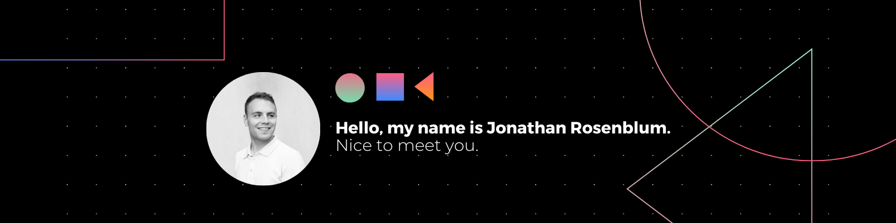

👋 Hi there! I'm Jon Rosenblum, a passionate software developer based in New York, NY. Let's embark on a journey through my software development endeavors! 🚀

## About Me 😃

I am an Agile Full-Stack Developer showcasing a diverse portfolio with front-end and back-end projects. I thrive on clean, collaborative coding experiences, working with teams to create captivating user interfaces. My true passion lies in bridging the gap between everyday users and technology, crafting inclusive and user-friendly applications. Let's collaborate to bring your projects to life and make a positive impact together.

## Github Stats 📈

  
  

## Key Skills 🛠️

<table>
     <tr>
        <td align="center" style="border:1px solid #3A424A">
            
             
        </td>
        <td align="center" style="border:1px solid #3A424A">
            
             
        </td>
        <td align="center" style="border:1px solid #3A424A">
            
             
        </td>
           <td align="center" style="border:1px solid #3A424A">
            
             
        </td>
        </td>
          <td align="center" style="border:1px solid #3A424A">
            
             
        </td>
    </tr>
    <tr>
        <td align="center" style="border:1px solid #3A424A">
            
             
        </td>
        <td align="center" style="border:1px solid #3A424A">
            
             
        </td>
        <td align="center" style="border:1px solid #3A424A">
            
             
        </td>
          <td align="center" style="border:1px solid #3A424A">
            
             
        </td>
        </td>
          <td align="center" style="border:1px solid #3A424A">
            
             
        </td>
    </tr>
    <tr>
        <td align="center" style="border:1px solid #3A424A">
            
             
        </td>
        <td align="center" style="border:1px solid #3A424A">
            
             
        </td>
        <td align="center" style="border:1px solid #3A424A">
            
             
        </td>
          <td align="center" style="border:1px solid #3A424A">
            
             
        </td>
        </td>
          <td align="center" style="border:1px solid #3A424A">
            
             
        </td>
    </tr>
    <tr>
         <td align="center" style="border:1px solid #3A424A">
            
             
        </td>
        <td align="center" style="border:1px solid #3A424A">
            
             
        </td>
        <td align="center" style="border:1px solid #3A424A">
            
             
        </td>
          <td align="center" style="border:1px solid #3A424A">
            
             
        </td>
        </td>
          <td align="center" style="border:1px solid #3A424A">
            
             
        </td>
    </tr>
    <tr>
        <td align="center" style="border:1px solid #3A424A">
            
             
        </td>
        <td align="center" style="border:1px solid #3A424A">
            
             
        </td>
        <td align="center" style="border:1px solid #3A424A">
            
             
        </td>
          <td align="center" style="border:1px solid #3A424A">
            
             
        </td>
        </td>
          <td align="center" style="border:1px solid #3A424A">
            
             
        </td>
    </tr>
      <tr>
        <td align="center" style="border:1px solid #3A424A">
            
             
        </td>
        <td align="center" style="border:1px solid #3A424A">
            
             
        </td>
        <td align="center" style="border:1px solid #3A424A">
            
             
        </td>
          <td align="center" style="border:1px solid #3A424A">
            
             
        </td>
        </td>
          <td align="center" style="border:1px solid #3A424A">
            
             
        </td>
    </tr>
    <tr>
</table>

## Education 🎓

- 🎓 Bachelor of Arts in Sociology, University of Georgia, May 2023
- 💻 Software Engineering Boot Camp, Flat Iron School - New York City, September 2023
- 🖥️ Full Stack Developer Boot Camp, Columbia Engineering, September 2022
- 🎓 School of Information, University of Michigan - Ann Arbor

## Certifications 🏆

- 💻 Software Engineering (Flat Iron School)
- ☁️ AWS Certified Cloud Practitioner
- 💻 Full-Stack Web Development (Columbia Engineering)

## Hobbies and Interests

- University of Georgia Football
- Study Abroad (Spain, London)
- Outdoor Adventures
- Volunteer Work

## Connect with Me 🔗

